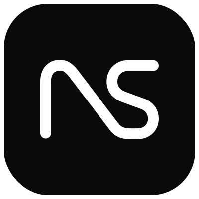
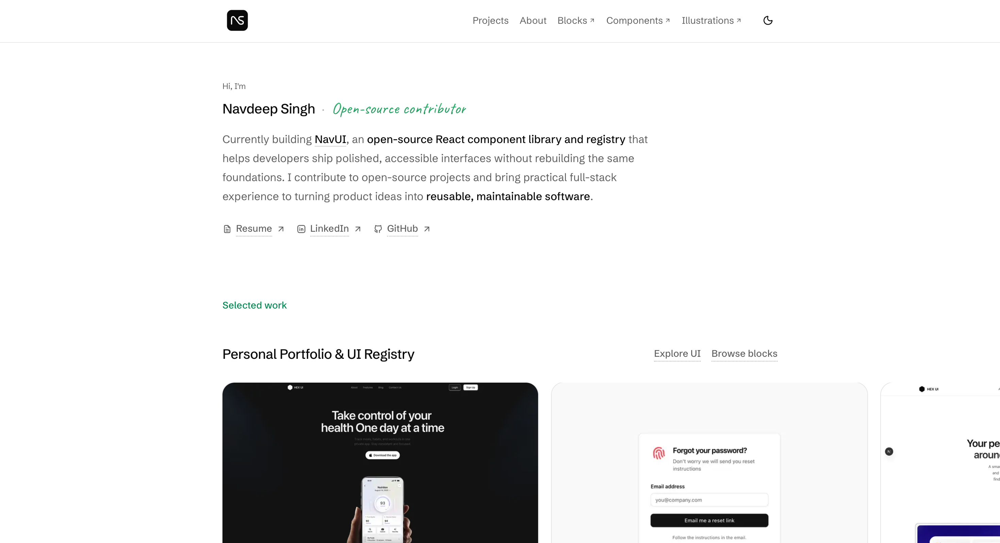
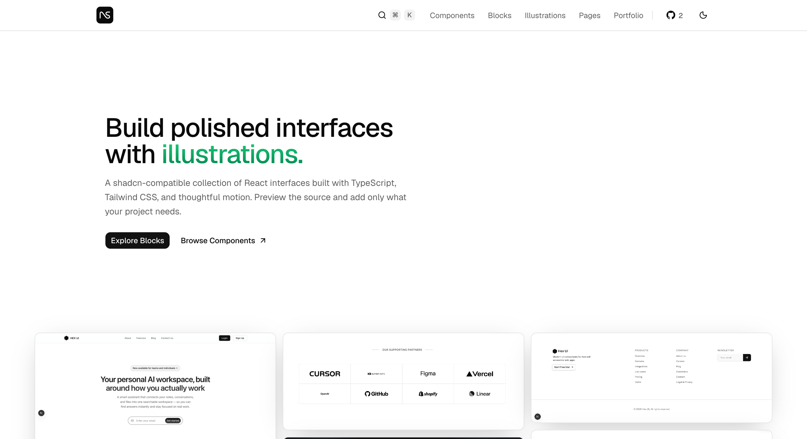

<div align="center">
  

  <h1>Portfolio & NavUI</h1>

  <p>
    One Next.js application for Navdeep Singh's portfolio and NavUI, a
    shadcn-compatible library of polished React interfaces.
  </p>

  <p>
    <a href="https://navdeepsingh.dev">Portfolio</a>
    ·
    <a href="https://ui.navdeepsingh.dev">NavUI</a>
    ·
    <a href="https://ui.navdeepsingh.dev/components">Components</a>
    ·
    <a href="https://ui.navdeepsingh.dev/blocks">Blocks</a>
  </p>
</div>

## Portfolio

A personal portfolio for selected work, project case studies, writing, and open-source contributions.

<a href="https://navdeepsingh.dev">
  
</a>

## NavUI

A shadcn-compatible collection of components, production-ready blocks, interface illustrations, and page templates. Preview the source and add only what your project needs.

<a href="https://ui.navdeepsingh.dev">
  
</a>

## About the project

Both sites are served from one Next.js application and Vercel project:

- `navdeepsingh.dev` serves the portfolio.
- `ui.navdeepsingh.dev` serves NavUI from the internal `/ui` route tree.
- `proxy.ts` handles hostname routing while keeping `/ui` out of public canonical URLs.
- Registry artifacts are published from `public/r` and can be installed with the shadcn CLI.

Built with Next.js 16, React 19, TypeScript, Tailwind CSS v4, shadcn/ui, Motion, and Bun.

## Local development

```bash
bun install
bun run dev
```

Open:

- Portfolio: `http://localhost:3000`
- NavUI with hostname routing: `http://ui.localhost:3000`
- NavUI internal route: `http://localhost:3000/ui`

## Registry

Install a registry item directly with the shadcn CLI:

```bash
bunx shadcn@latest add https://ui.navdeepsingh.dev/r/animated-tabs.json
```

Build and validate all registry artifacts:

```bash
bun run registry:build
```

## Checks

bun test
bun run build

## License

Licensed under the [MIT license](./LICENSE).

