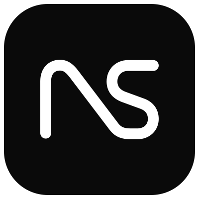
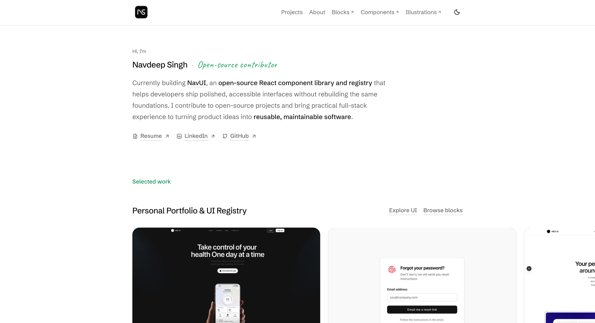
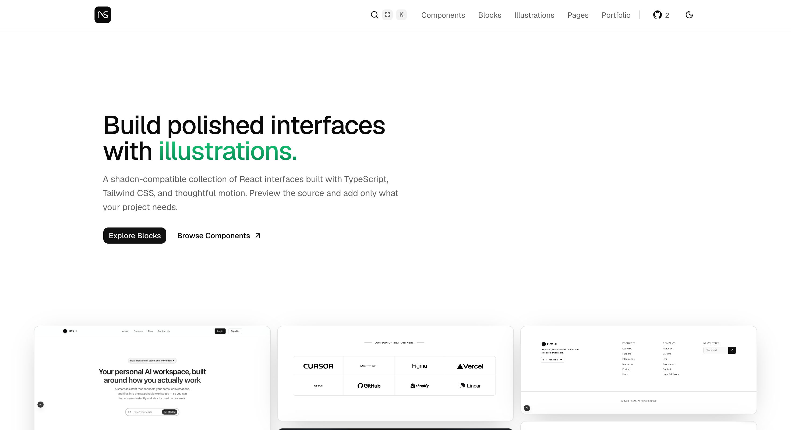

<div align="center">
  

  <h1>Portfolio & NavUI</h1>

  <p>
    One Next.js application for Navdeep Singh's portfolio and NavUI, a
    shadcn-compatible library of polished React interfaces.
  </p>

  <p>
    <a href="https://navdeepsingh.dev">Portfolio</a>
    ·
    <a href="https://ui.navdeepsingh.dev">NavUI</a>
    ·
    <a href="https://ui.navdeepsingh.dev/components">Components</a>
    ·
    <a href="https://ui.navdeepsingh.dev/blocks">Blocks</a>
  </p>
</div>

## Portfolio

A personal portfolio for selected work, project case studies, writing, and open-source contributions.

<a href="https://navdeepsingh.dev">
  
</a>

## NavUI

A shadcn-compatible collection of components, production-ready blocks, interface illustrations, and page templates. Preview the source and add only what your project needs.

<a href="https://ui.navdeepsingh.dev">
  
</a>

## About the project

Both sites are served from one Next.js application and Vercel project:

- `navdeepsingh.dev` serves the portfolio.
- `ui.navdeepsingh.dev` serves NavUI from the internal `/ui` route tree.
- `src/proxy.ts` handles hostname routing while keeping `/ui` out of public canonical URLs.
- Registry artifacts are published from `public/r` and can be installed with the shadcn CLI.

Built with Next.js 16, React 19, TypeScript, Tailwind CSS v4, shadcn/ui, Motion, and Bun.

## Local development

```bash
bun install
bun run dev
```

Open:

- Portfolio: `http://localhost:3000`
- NavUI with hostname routing: `http://ui.localhost:3000`
- NavUI internal route: `http://localhost:3000/ui`

## Registry

Install a registry item with the official `@navui` namespace:

```bash
bunx shadcn@latest add @navui/animated-tabs
```

Generate and validate all registry artifacts:

```bash
bun run registry:generate
bun run registry:validate
```

Canonical item metadata is colocated under `src/registry`, with explicit aggregators in
`src/registry/items`. See
[`docs/navui-registry.md`](./docs/navui-registry.md) before adding or publishing an item.

The reusable `ContributionGraph` and `PublicInsights` components contain presentation only. Their
portfolio data adapters remain server-only and are not included in registry installs.

## Public data

Copy `.env.example` to `.env.local` and add only the credentials you want to enable:

- `GITHUB_TOKEN` and `GITHUB_USERNAME` load merged pull requests and the GitHub contribution
  calendar through GitHub GraphQL. Responses are normalized on the server; contribution data is
  cached for six hours.
- `VERCEL_TOKEN` and `VERCEL_PROJECT_ID` load anonymous aggregate visitors and page views through
  Vercel Web Analytics. Add `VERCEL_TEAM_ID` for a team-owned project. Current and previous 28-day
  ranges are queried separately and cached for six hours.

No credential uses a `NEXT_PUBLIC_` prefix. The public analytics section remains hidden when Vercel
credentials are absent or the provider fails, and `/api/public-insights` returns only allowlisted
aggregate fields.

## Repository checks

Bun is the only package manager used by this repository. Install dependencies and run the full
validation baseline with:

```bash
bun install
bun run check
bun run build
```

Dependency changes must include the updated `bun.lock`. Do not introduce `package-lock.json`,
`pnpm-lock.yaml`, or `yarn.lock`.

## License

Licensed under the [MIT license](./LICENSE).
